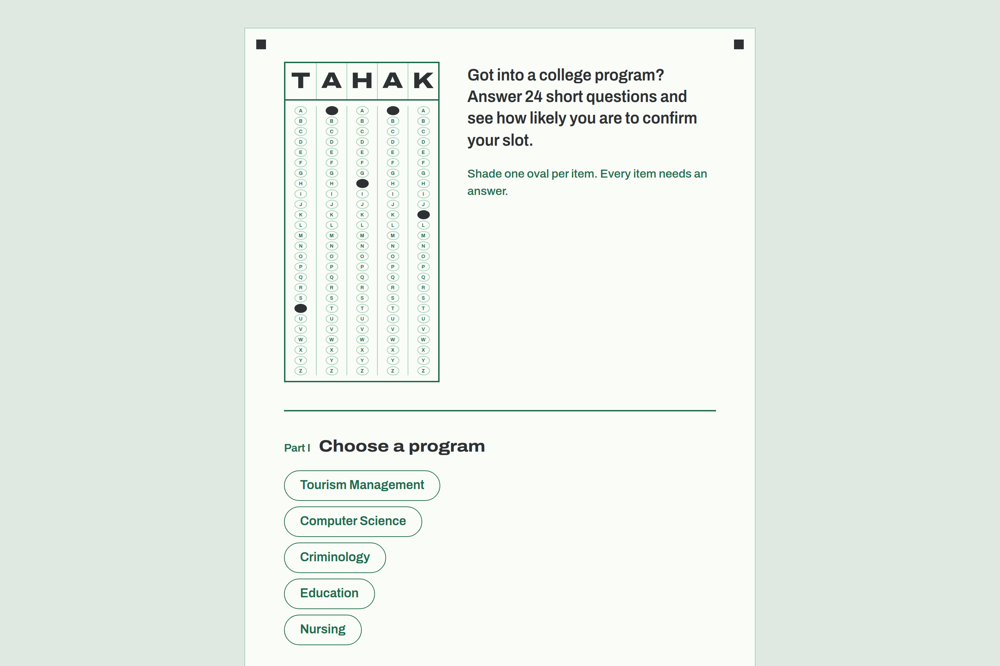
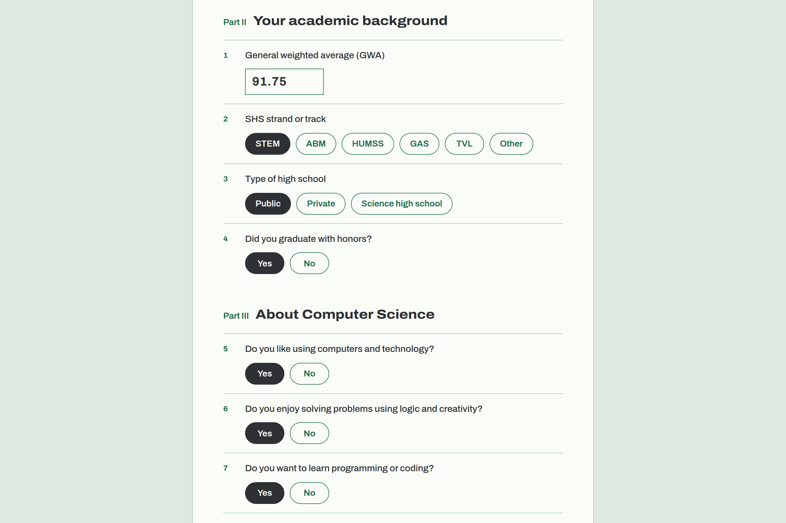

# TAHAK: Slot Confirmation Check

**Got into a college program? Answer 24 short questions and see how likely you are to confirm your slot.**

| | |
|---|---|
| **Role** | Frontend design and development, backend API, deployment |
| **Stack** | HTML, CSS, vanilla JavaScript · Python, FastAPI · Vercel, Render |
| **Live site** | _add your Vercel URL_ |
| **Code** | [github.com/emannnnn23/DecisionPulsify](https://github.com/emannnnn23/DecisionPulsify) |



---

## The problem

In the Philippines, students who pass a college admission still have to confirm their slot, and many don't. Some realize the program isn't for them. Others can't afford it, the school is too far, or they got into something else. TAHAK asks a senior-high graduate 24 short questions about their grades, their interest in the program and their situation. It then estimates how likely they are to actually take the slot.

Students can use it to test a choice before enrollment. Schools and guidance counselors can see which factors matter most.

## Where I started

I took over an existing prototype. It was a single static web page with 24 dropdown menus and a purple gradient theme, and a logistic regression model ran entirely in the browser. It worked on a laptop, but it had no backend, wasn't set up to deploy, and its design gave no sense of who it was for.

I set four goals:

1. Make it deployable, with a real API behind it.
2. Make it trustworthy, with correct scoring and honest wording.
3. Give it an identity that fits its users.
4. Make it quick to fill in on a phone.

## What I built

### 1. A frontend and API that deploy separately

I split the project into a static frontend for **Vercel** and a **FastAPI** service for **Render**.

```
Browser (Vercel)                         API (Render)
┌──────────────────────┐   POST          ┌──────────────────────────┐
│ index.html           │  /api/predict   │ FastAPI                  │
│ styles.css           │ ──────────────▶ │  • input validation      │
│ script.js            │ ◀────────────── │  • logistic regression   │
│  └ local fallback    │   p_confirm     │  • CORS by allowed origin│
└──────────────────────┘                 └──────────────────────────┘
```

- **Validated API.** Pydantic models reject bad input before any math runs, such as a GWA outside 70–100, an unknown strand or a missing answer. The API has `/health` for Render's health checks and interactive docs at `/docs`.
- **Locked-down CORS.** Allowed origins come from an environment variable, so in production only the Vercel site can call the API.
- **Cold-start fallback.** Render's free plan sleeps when idle and can take up to a minute to wake. The frontend waits 8 seconds for the API, then computes the same result in the browser, so the user never sees a broken page.
- **One-click setup.** A `render.yaml` blueprint and a `vercel.json` handle deployment, and the frontend detects whether it's running locally or in production.

### 2. A scoring bug fix

While moving the model to Python, I compared the API's output with the browser's and found a bug. The "graduated with honors" factor, one of the strongest in every model, **was never applied**. The code split the feature name `with_honors_Yes` on underscores, so it looked for a form field called `with` that didn't exist. Every honors student was getting a wrong prediction.

I fixed it on both sides. After the fix, the API and the browser fallback return the same probability to all 17 digits.

### 3. A redesign based on the exam answer sheet

The users are 17- and 18-year-old Filipino students who have just been through college entrance exams. Every one of them knows the answer sheet where you shade ovals with a pencil. Every question in TAHAK is multiple choice, so the answer sheet became both the visual identity and the way you answer.



- **The name is a name grid.** The header copies the grid on an exam sheet where you shade the letters of your name. "TAHAK" is written in the boxes, and the matching letters shade themselves in when the page loads. It's the only decorative animation on the page.
- **Every answer is an oval** with the word inside ("Yes", "STEM", "Public"). Tapping one shades it in pencil graphite.
- **Colors come from the sheet itself:** green ink on white paper, graphite for marks, and a teacher's red pen for errors and low results. The four black squares in the corners are the alignment marks a scanning machine uses to read a real answer sheet.
- **One typeface,** Archivo. I used its variable width axis instead of a second font: extra wide and heavy for the name and the result, normal width for the questions.
- **The result echoes the sheet.** The percentage counts up while a row of 20 ovals shades in, one for every 5%.

<p>
  
  
  
</p>

### 4. Usability and accessibility

- **Clearer errors.** If you submit with blanks, the missing items turn red, the page jumps to the first one, and a message says how many are left. Before, it just said "fill in all required fields."
- **A progress counter** ("22 of 24 answered") beside the submit button.
- **Honest wording.** The original result said "You are very likely to be confirmed," which suggests the school decides. The model actually predicts whether the *student* will confirm. It now says "You'd very likely confirm your slot," and the footer makes clear it's an estimate, not an admission decision.
- **Accessible controls.** The ovals are real radio buttons grouped in fieldsets, so they work with a keyboard and a screen reader. Focus is always visible, and animations switch off when the user prefers reduced motion.
- **Fewer dependencies.** I removed the Tailwind CDN script, the loading spinner and the confetti library. The page now loads one stylesheet I wrote and one font.

## How the prediction works

Each program has its own logistic regression model. Every answer adds a weight, positive or negative, to a score, and the score is converted to a probability:

```
z = intercept + Σ (weight × answer) + weight_gwa × scaled GWA
P(decline) = 1 / (1 + e^(−z))
P(confirm) = 1 − P(decline)
```

The inputs are GWA (scaled to 0–1), SHS strand, school type, honors, 10 questions specific to the program and 10 general ones about family support, cost, scholarships and distance.

**Limitations.** The Computer Science model's weights come from analysis of real student survey data. The other four programs (Nursing, Tourism, Criminology and Education) use estimated weights to demonstrate the experience. Collecting survey data for each program and retraining those models would be the next step before using them for real decisions.

## Testing

- Drove the running app in headless Chrome through the DevTools protocol: picked a program, filled all 24 items, submitted, and confirmed in the server log that the browser called the API (`POST /api/predict 200`).
- Checked layouts at 1440px and 390px wide, with no horizontal scrolling on phones.
- Checked that the API rejects invalid input with clear messages.

## What I'd do next

- Train real models for the four estimated programs and serve them from the API, so the coefficients live in one place instead of two.
- Show which three answers moved the result most, so students know what to think about.
- Add a dark mode, and a Filipino-language version of the questions.

---

_Built by Emanuel._
